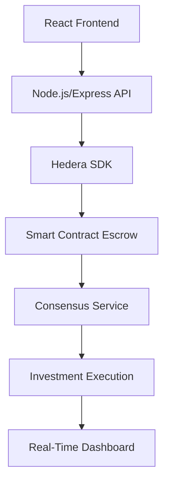

# Pesadrop MVP (Hedera-Powered Micro-Investing Platform) 🌐🚀

**Category**: Capital Markets | **Blockchain**: Hedera Hashgraph | **Stage**: MVP Development

## 📌 Overview
Pesadrop democratizes access to capital markets by enabling fractional HBAR investments via Hedera's enterprise-grade DLT. The MVP leverages HBAR's low fees (<$0.01 transactions) and 10,000 TPS capabilities to create scalable micro-investment pools.

---

## ✅ Market Viability
| Factor               | Advantage                                                                 |
|----------------------|---------------------------------------------------------------------------|
| **Hedera Fit**        | Near-free transactions enable true micro-investing (<$1 positions)        |
| **Target Market**     | 1.7B underbanked adults • 75% of Gen Z interested in fractional investing |
| **Regulatory Edge**   | Hedera's ABFT compliance aligns with financial regulations               |
| **Tech moat**         | Native tokenization • 3-second finality • Carbon-negative network         |

---

## ⚙️ Project Architecture


# Pesadrop Smart Contract

## Overview

The **Pesadrop Smart Contract** is a Solidity-based contract designed to manage pooled deposits, allowing users to contribute funds until a predefined target is reached. Once the target amount is deposited, the contract can be deployed to utilize the pooled funds. This contract is ideal for scenarios where multiple participants want to pool resources for a common goal, with the assurance that funds can only be withdrawn before the target is reached, and the pool is only deployed once the target is met.

### Key Features:

- **Deposit Funds**: Users can deposit HBAR into the contract until the target amount (`poolTarget`) is reached.
- **Withdraw Funds**: Users can withdraw their contributions before the target is reached.
- **Deploy Pool**: The owner of the contract can trigger the deployment of the pool once the target deposit is met. Deployment logic can be added for further actions like investment.

---

## Contract Code

```solidity
// SPDX-License-Identifier: MIT
pragma solidity ^0.8.17;

contract HBARPoolEscrow {
    address public owner;
    uint256 public poolTarget;
    uint256 public totalDeposited;
    mapping(address => uint256) public balances;

    constructor(uint256 _targetInTinybar) {
        owner = msg.sender;
        poolTarget = _targetInTinybar;
    }

    function deposit() external payable {
        require(totalDeposited + msg.value <= poolTarget, "Pool target reached");
        balances[msg.sender] += msg.value;
        totalDeposited += msg.value;
    }

    function withdraw() external {
        require(totalDeposited < poolTarget, "Pool already deployed");
        uint256 amount = balances[msg.sender];
        balances[msg.sender] = 0;
        (bool sent,) = payable(msg.sender).call{value: amount}("");
        require(sent, "Withdrawal failed");
    }

    function deployPool() external view {
        require(msg.sender == owner, "Unauthorized");
        require(totalDeposited >= poolTarget, "Target not met");
        // Investment logic would go here
    }
}
```

---

## How to Generate Bytecode and Deploy the Contract

### 1. **Generating Bytecode and ABI**

To deploy the contract, we first need to compile the contract to generate the bytecode and ABI. We used the following command to do this:

```bash
npx solc --bin --abi --optimize --output-dir build HBARPoolEscrow.sol
```

This command will generate two files:
- **HBARPoolEscrow.bin**: The bytecode of the compiled contract.
- **HBARPoolEscrow.abi**: The Application Binary Interface, which defines how to interact with the contract.

These files are essential for the deployment and interaction with the contract on the Hedera network.

### 2. **Deploying the Contract**

Once the bytecode and ABI are generated, you can deploy the contract using your preferred method. If you're using Hedera, follow their documentation for deploying contracts on their network. After a successful deployment, you will receive a **Contract ID**, which uniquely identifies your contract on the Hedera network.

---

## Verifying the Contract on Hashscan

After deploying the contract, we wanted to verify it on Hashscan to ensure everything was properly deployed and transparent.

### 1. **Challenges with Metadata**

Initially, we encountered an issue when attempting to generate the metadata file, which is needed for Hashscan verification. The `--metadata` option in `solc` was not working with the version we were using, resulting in the following error:

```
error: unknown option '--metadata'
```

This issue arose because the `solc` compiler version `0.8.29` we were using did not fully support the `--metadata` flag as expected.

### 2. **Solution: Using the `solcjs` JavaScript API**

To solve this issue, we resorted to using the **Solidity Compiler JavaScript API** (`solcjs`), which allowed us to manually compile the contract and extract the metadata.

#### **Steps to Generate Metadata with `solcjs`**:

We created a simple Node.js script to generate the metadata along with the ABI and bytecode.

```javascript
const fs = require('fs');
const solc = require('solc');

// Read the Solidity source file
const source = fs.readFileSync('HBARPoolEscrow.sol', 'utf8');

// Compile the contract using solcjs
const output = JSON.parse(solc.compile(JSON.stringify({
  language: 'Solidity',
  sources: {
    'HBARPoolEscrow.sol': {
      content: source
    }
  },
  settings: {
    outputSelection: {
      '*': {
        '*': ['abi', 'evm.bytecode', 'metadata']
      }
    }
  }
})));

// Extract the metadata
const metadata = output.contracts['HBARPoolEscrow.sol'].HBARPoolEscrow.metadata;

// Write the metadata to a file
fs.writeFileSync('build/HBARPoolEscrow-metadata.json', metadata);

console.log('Metadata file created!');
```

After running the above script, we successfully generated the `metadata` JSON file, along with the `abi` and `bin` files.

---

### 3. **Uploading for Verification**

With the following files ready for verification:
- **HBARPoolEscrow.sol** (Solidity source file)
- **HBARPoolEscrow-metadata.json** (Metadata file)
- **HBARPoolEscrow.abi** (ABI file)

We uploaded them to Hashscan to complete the contract verification process. Hashscan then compiled the source code and matched it with the deployed contract bytecode on the Hedera network, confirming the contract's authenticity.

---
## Interacting with the Smart Contract

I interacted with the smart contract by calling its functions such as `deposit`, `withdraw`, and `deployPool`. The interactions were done using a JavaScript file (`interact.js`), which allows me to deposit HBAR into the contract, withdraw funds, and deploy the pool when the target amount has been reached.
Here are the logs of the interactions, but note that the balance is zero, which is why the transactions might not have been successful:

## Issues Encountered and Solutions

### Issue 1: **`--metadata` Flag Not Working**
- **Error Message**: `unknown option '--metadata'`
- **Solution**: We switched to using `solcjs` (JavaScript API), which allowed us to compile the contract and manually extract the metadata.

### Issue 2: **Empty Build Folder**
- **Error Message**: The build folder was empty when attempting to upload files.
- **Solution**: We ensured that the compiled files were properly written to the build directory by using `npx solcjs` for a more reliable compilation and file generation process.


---

This README provides a structured guide through the process of compiling, deploying, and verifying the smart contract. It explains the functionality, the deployment steps, and how we solved the metadata generation issue. It also includes troubleshooting tips for errors encountered during the process.

### Core Components
- **Hedera Wallet Integration**: Account creation via Hedera JS SDK
- **Escrow System**: HBAR pool managed via Hedera Smart Contract (HIP-482)
- **Auto-Invest**: Threshold-triggered transactions using Hedera Scheduled TX
- **Analytics**: Mirror node queries for real-time pool tracking

---

## 📈 Business Model
**Revenue Streams**  
1. 0.3% platform fee on pooled investments  
2. Premium analytics subscriptions ($4.99/month)  
3. Institutional API access (Q2 2025)  
4. Partner onboarding fees (Brokerage integrations)  

**Target Markets**  
📍 Emerging markets (Africa/SE Asia) • Millennial/Gen Z investors • Crypto-native DAOs  

---

## 🚀 Projections & Milestones

| Quarter     | Goal                                | Metric Target       |
|-------------|-------------------------------------|---------------------|
| Q4 2024     | MVP Launch                          | 1,000 active users  |
| Q1 2025     | Mobile App Release                  | $50k pooled HBAR    |
| Q3 2025     | Multi-Asset Support (Stablecoins)   | 10,000 MAU          |
| Q4 2025     | DAO Governance Implementation       | $1M TVL             |

---

## 🔜 Next Phase Development
### Backend Priorities
- HIP-206 Tokenization of pool shares
- Integration with Hedera Consensus Service
- Risk engine for auto-rebalancing

### Frontend Priorities
- HBAR ↔ fiat ramp integration
- Interactive investment simulator
- Social proof features (Pool leaderboards)

---

**Powered by Hedera's ESG-aligned infrastructure** 🌱  
*Enterprise-grade decentralization meets accessible capital markets*  
```