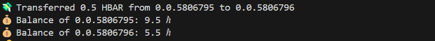

# Pesadrop MVP (Hedera-Powered Micro-Investing Platform)

**Category**: Capital Markets | **Blockchain**: Hedera Hashgraph | **Stage**: MVP Development

## Overview
Pesadrop is a decentralized micro-investing platform based in Kenya, built on Hedera Hashgraph. The platform democratizes access to capital markets by enabling users to pool HBAR investments with minimal transaction fees and maximum scalability. Pesadrop allows users to create accounts, transfer funds for pool investments, and invest in fractional HBAR positions, all while leveraging the power of Hedera’s fast and secure blockchain.

---

## Key Features

- **Account Creation**: Users can easily create accounts to participate in investment pools.
- **Fund Transfers**: Seamlessly transfer HBAR into investment pools and withdraw funds as needed.
- **Smart Contracts**: Pesadrop uses smart contracts to manage pooled investments, ensuring transparency, security, and efficiency. Once a predefined investment target is reached, the pool is deployed for further use.
- **Hedera Integration**: Built on Hedera’s enterprise-grade Distributed Ledger Technology (DLT), the platform benefits from low transaction fees (<$0.01 per transaction) and 10,000 transactions per second (TPS), making it ideal for micro-investing.
- **Kenya-Based**: Focused on addressing the needs of the Kenyan market, while also providing access to global capital markets.

---

## Project Architecture

### Frontend
- **User Interface**: The frontend is designed to be intuitive and user-friendly, allowing users to create accounts, view available investment pools, and perform transactions (deposit/withdraw) directly from the dashboard.

- **Interactive Analytics**: Real-time tracking of pool progress and investment performance via an easy-to-use analytics dashboard.

### Backend
- **Hedera Integration**: Users can create and manage Hedera accounts using the Hedera JS SDK, enabling seamless wallet interactions for both Kenyan and international users.
For this product demo,The process begins by creating two user accounts on the platform. Each user will receive a specific amount of HBAR to start with. 

Here is hashscan links to both accounts
https://hashscan.io/testnet/account/0.0.5806289?ps=1&pt=1&pa=1&pn=1&pf=1&pr=1&ph=1&pc=1&p3=1
https://hashscan.io/testnet/account/0.0.5806287?ph=1&kh=0.0.5806289&ps=1&pc=1&pf=1&pa=1&pr=1&pt=1&pn=1&p3=1
One user will receive 10 HBAR, while the other receives 5 HBAR.

Now that both users have accounts and balances, one user can transfer a portion of their HBAR to the other user. For instance, User 1 might send 0.5 HBAR to User 2. This transaction facilitates the pooling of funds for investment.

- **Escrow System**: Investment pools are managed through Hedera Smart Contracts (HIP-482), which handle deposits, withdrawals, and the deployment of funds once the target amount is reached.
- **Auto-Invest**: Threshold-triggered transactions using Hedera Scheduled Transactions ensure automated investments once a pool reaches the target amount.
- **Analytics**: Mirror node queries are used for real-time tracking of pool investments and transaction history.

### Smart Contract
- **HBAR Pool Smart Contract**: A Solidity-based contract that manages pooled HBAR investments. Key features include:
  - **Deposit Funds**: Users can deposit HBAR into a pool until the target is met.
  - **Withdraw Funds**: Users can withdraw their contributions before the target is reached.
  - **Deploy Pool**: Once the target amount is deposited, the pool can be deployed for investment use by the owner.

---

## Business Model

### Revenue Streams
- **Platform Fee**: A 0.3% fee is charged on all pooled investments.
- **Premium Analytics**: $4.99/month for premium access to advanced investment analytics.
- **Institutional API Access**: Available in Q2 2025, providing institutional clients with API access to manage large pools.
- **Partner Onboarding Fees**: Fees for brokerages and other financial institutions that wish to integrate with the Pesadrop platform.

### Target Audience
- **Kenyan Investors**: Targeting emerging markets in Kenya, focusing on the underbanked population and those interested in fractional investing.
- **Millennials & Gen Z**: Focus on younger, tech-savvy individuals eager to explore alternative investment opportunities and participate in capital markets.
- **Crypto-Native DAOs**: Pesadrop also aims to integrate decentralized finance (DeFi) solutions, offering governance-driven investment pools.

---

## Development Roadmap

### Backend Priorities
- **Tokenization**: Implement HIP-206 for tokenizing pool shares.
- **Hedera Consensus Service**: Integrate with Hedera’s Consensus Service to ensure data transparency and integrity.
- **Risk Engine**: Develop an auto-rebalancing risk engine to manage investment pool risks.

### Frontend Priorities
- **Fiat ↔ HBAR Ramp**: Enable easy conversion between Kenyan Shilling (KES) and HBAR for local users.
- **Investment Simulator**: Build an interactive tool to allow users to simulate potential returns and explore investment opportunities.
- **Social Proof Features**: Leaderboards and testimonials to help build user trust and engagement.

---

## Milestones & Projections

| Quarter     | Goal                     | Metric Target       |
|-------------|--------------------------|---------------------|
| Q4 2024     | MVP Launch               | 1,000 active users  |
| Q1 2025     | Mobile App Release       | $50k pooled HBAR    |
| Q3 2025     | Multi-Asset Support      | 10,000 Monthly Active Users |
| Q4 2025     | DAO Governance           | $1M Total Value Locked (TVL) |

---

## Powered by Hedera’s ESG-Aligned Infrastructure 🌱
Pesadrop leverages Hedera's carbon-negative infrastructure to provide an environmentally responsible, enterprise-grade platform for micro-investing. Pesadrop helps bridge the gap between global capital markets and Kenyan investors while promoting financial inclusion.

---
